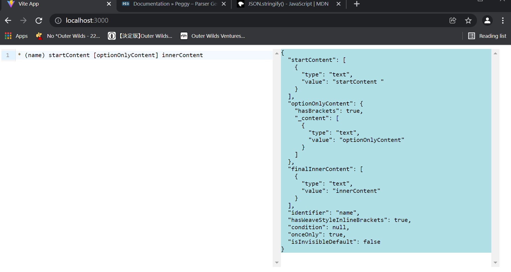

This is an attempt to implement the compiler for Inkle's ink scripting language using the Peggy JS library. The grammar definition is contained in 'src/grammar/_ink_main2.pegjs'.

If you would like to check the work out, simply clone the repository, run `npm install` in the root directory, then `npm run dev`. This will start up a local dev server with a web page that looks like this:

The page will automatically update and re-run the parser whenever the following occurs:
- the contents of the input field are changed
- the grammar file is changed

If the parser runs into an error while attempting to process text, the offending line & column will be listed, along with an appropriate error message.

Both the source [ink](https://github.com/inkle/ink) and the [ink-tmlanguage](https://github.com/inkle/ink-tmlanguage) Github repository was used as a reference.